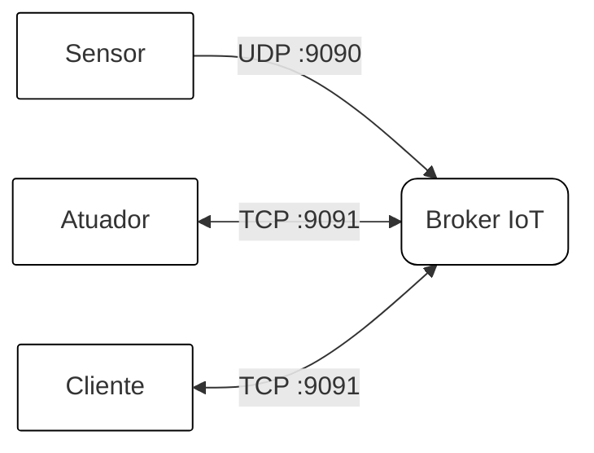

# 🌐 Broker IoT — Sistema de Integração para Dispositivos IoT

Sistema de comunicação para IoT composto por um broker central que intermedia sensores, atuadores e clientes, eliminando o acoplamento direto entre os dispositivos.

---

## 📁 Estrutura de Diretórios

```
pbl-1/
├── broker/                     # Serviço central de intermediação
│   ├── config/
│   │   └── config.go           # Constantes de configuração (IPs e portas)
│   ├── handler/
│   │   ├── tcp_handler.go      # Handler das conexões TCP (clientes e atuadores)
│   │   └── udp_handler.go      # Handler das mensagens UDP (sensores)
│   ├── model/
│   │   └── models.go           # Structs: Sensor, Atuador, Cliente
│   ├── netServer/
│   │   ├── tcp.go              # Inicialização do servidor TCP (:9091)
│   │   └── udp.go              # Inicialização do servidor UDP (:9090)
│   ├── repository/
│   │   ├── repository.go       # Lógica de negócio e armazenamento em memória
│   │   └── heartBeat.go        # Monitoramento de sensores inativos
│   ├── main.go                 # Ponto de entrada do broker
│   ├── Dockerfile
│   └── docker-compose.yml
│
├── sensores/                   # Dispositivo virtual sensor
│   ├── main.go                 # Envia DATA via UDP a cada 500ms
│   ├── Dockerfile
│   └── docker-compose.yml
│
├── atuadores/                  # Dispositivo virtual atuador
│   ├── atuador.go              # Recebe comandos ON/OFF via TCP e responde
│   ├── Dockerfile
│   └── docker-compose.yml
│
└── client/                     # Aplicação cliente (interface terminal)
    ├── client.go               # Menu interativo, segue sensores e comanda atuadores
    ├── Dockerfile
    └── docker-compose.yml
```

---

##  Pacotes e Dependências

### Broker
| Pacote | Uso |
|--------|-----|
| `net` | Conexões TCP e UDP nativas |
| `sync` | Mutex para proteção dos maps compartilhados |
| `bufio` | Leitura de mensagens linha a linha via TCP |
| `time` | Heartbeat e controle de timeout |

### Cliente
| Pacote | Uso |
|--------|-----|
| `net` | Conexão TCP com o broker |
| `bufio` | Leitura de mensagens e input do usuário |
| `os/exec` | Limpeza de tela multiplataforma |
| `github.com/charmbracelet/lipgloss` | Estilização do terminal |

> **Nenhum framework de mensageria foi utilizado.** Toda a comunicação é feita com os pacotes nativos de rede do Go (`net`), conforme requisito do projeto.

---

##  Protocolo de Comunicação

### Canal UDP — Porta 9090 (Sensores)

| Comando | Descrição |
|---------|-----------|
| `REGISTER-SENSOR <nick>` | Registra o sensor no broker |
| `DATA <nick> <valor>` | Envia leitura do sensor |
| `DEBUG` | Exibe a lista de sensores e clientes.
| `HELP` | Exibe comandos disponíveis |

### Canal TCP — Porta 9091 (Clientes e Atuadores)

| Comando | Descrição |
|---------|-----------|
| `REGISTER-CLIENT <nick>` | Registra o cliente |
| `REGISTER-ATUADOR <nick>` | Registra o atuador |
| `COMMAND <nick> <ON/OFF>` | Envia comando ao atuador |
| `SEGUIR-SENSOR <nick>` | Inscreve cliente no sensor |
| `PARAR-SENSOR <nick>` | Cancela inscrição no sensor |
| `LIST-SENSORES` | Lista sensores conectados |
| `LIST-ATUADORES` | Lista atuadores conectados |
| `LIST-CLIENTES` | Lista clientes conectados |
| `PING` | Verifica conexão com o broker |
| `QUIT` | Encerra a conexão |
| `HELP` | Exibe comandos disponíveis |

---

##  Como Executar

### Pré-requisitos
- [Docker](https://docs.docker.com/) instalado
- [Go 1.21+](https://go.dev/) (para execução local sem Docker)

---

### 1. Subir o Broker

```bash
cd broker/
docker compose up
```

O broker ficará disponível em:
- UDP: `(ip do pc):9090` 
- TCP: `(ip do pc):9091`

---

### 2. Subir os Sensores

```bash
cd sensores/
SERVER_ADDR=<IP_DO_BROKER> docker compose up
```

Cada instância do sensor se registra automaticamente usando o hostname do container como identificador.

Para múltiplas instâncias:
```bash
SERVER_ADDR=<IP_DO_BROKER> docker compose up --scale sensor=3
```

---

### 3. Subir os Atuadores

```bash
cd atuadores/
SERVER_ADDR=<IP_DO_BROKER> docker compose up
```

Para múltiplas instâncias:
```bash
SERVER_ADDR=<IP_DO_BROKER> docker compose up --scale atuador=3
```

---

### 4. Subir o Cliente

```bash
cd client/
docker run -it -e SERVER_ADDR=<IP_DO_BROKER>:9091 tonito12/client:cla
```

> O `-it` é obrigatório pois o cliente é interativo.

---

### Execução Local (sem Docker)

```bash
# broker
cd broker/
go run main.go

# sensor
cd sensores/
go run main.go

# atuador
cd atuadores/
SERVER_ADDR=localhost go run atuador.go

# cliente
cd client/
go get github.com/charmbracelet/lipgloss
SERVER_ADDR=localhost:9091 go run client.go
```

---

##  Como Usar o Cliente

Ao iniciar o cliente, digite seu nick e utilize o menu interativo:

```
╭──────────────────────────────────────────╮
│       🌐  BROKER IoT - CLIENTE           │
│         conectado como: antonio          │
│                                          │
│  [1] Listar sensores                     │
│  [2] Seguir sensor                       │
│  [3] Parar de seguir sensor              │
│  [4] Listar atuadores                    │
│  [5] Comandar atuador                    │
│  [6] Listar clientes                     │
│  [7] Sair                                │
╰──────────────────────────────────────────╯
```

**Fluxo típico:**
 `1` — Lista os sensores disponíveis e anota o nick
 `2` — Digita o nick do sensor para receber dados em tempo real
 `3` — Para de receber dados do sensor atual
 `4` — Lista os atuadores conectados
 `5` — Digita o nick do atuador e o comando `ON` ou `OFF`
 `6` — Lista os clientes conectados
 `7` — Sai do sistema

---

##  Teste de Concorrência

Para simular dois clientes enviando comandos simultâneos ao mesmo atuador:

```bash
cd test/
go run teste_concorrencia.go <nick_do_atuador>

# exemplo:
go run teste_concorrencia.go 27d18a87640b
```

---

## 🏗️ Arquitetura




- **Sensores** enviam dados via UDP (sem conexão, tolerante a perdas)
- **Atuadores** mantêm conexão TCP persistente aguardando comandos
- **Clientes** se inscrevem em sensores e enviam comandos a atuadores via TCP

---

##  Desenvolvedor

<table>
  <tr>
    <td align="center" width="150px">
      <a href="https://github.com/antoniomedeiross">
        <br />
        <sub><b>Antonio Medeiros</b></sub>
      </a>
      <br>
      <br>
      <a href="https://linkedin.com/in/antoniomedeiross" title="LinkedIn">
        
      </a>
    </td>
    <td>
      <strong>Antônio Aparecido Medeiros Santana</strong><br>
      Universidade Estadual de Feira de Santana — UEFS<br>
      Departamento de Tecnologia — DTEC<br>
      antoniomedeirosdev@gmail.com
    </td>
  </tr>
</table>